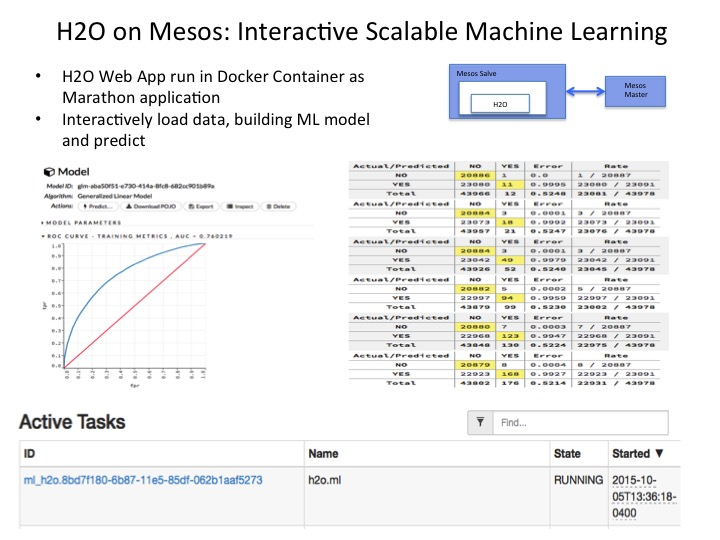
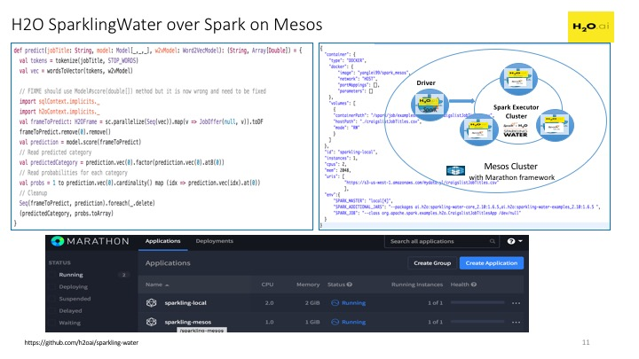

## H2O on Mesos 

[H2O](https://github.com/h2oai/h2o-3)

### H2O Standalone

#### Build Docker Image 

[Reference instruction](http://docs.h2o.ai/h2o/latest-stable/h2o-docs/index.html?_ga=1.155258232.234925875.1465849825#…%20Using%20Docker)

[Reference Dockerfile](https://github.com/h2oai/h2o-3/blob/master/Dockerfile)

	mkdir h2oai
	cd h2oai
	wget https://raw.githubusercontent.com/h2oai/h2o-3/master/Dockerfile
	docker build -t h2oai .

#### Run on Marathon:
	
	curl -i -H 'Content-Type: application/json' -d@marathon/marathon.json $marathonIp:8080/v2/apps
	
* [revise job](marathon/marathon.json). The h2o console is at http://$HOST_IP:54321

### H2O over Spark (SparkingWater)

[reference](https://github.com/h2oai/sparkling-water)

#### Run example on Marathon with local Spark cluster:
	
	curl -i -H 'Content-Type: application/json' -d@marathon/marathon-sparkling-local.json $marathonIp:8080/v2/apps
	
* [revise job](marathon/marathon-sparkling-local.json). The h2o console is at http://$HOST_IP:54321

#### Run example on Marathon with Spark Mesos cluster:
	
	curl -i -H 'Content-Type: application/json' -d@marathon/marathon-sparkling-mesos-docker.json $marathonIp:8080/v2/apps
	
* [revise job](marathon/marathon-sparkling-mesos-docker.json). The h2o console is at http://$HOST_IP:54321

#### Known Issue

* H2O SparklingWater sample file loading relies on hostname resolution. You may need to define host mapping in mesos slave's /etc/hosts

* H20 SparklingWather sample does not work with Spark Mesos Cluster model due to file loading