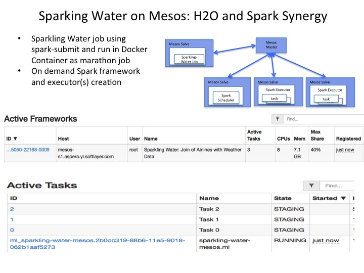

## Sparkling Water on Mesos 

[Sparkling Water](https://github.com/h2oai/sparkling-water.git)

### Build Docker Image 

[The image details](Dockerfile)

* Download Spark 1.5.1 with Hadoop 2.6 
* Download Spark SQL Cloudant 1.5.1.0
* Download Sparkling Water

### Start on Marathon:
	
	curl -i -H 'Content-Type: application/json' -d@marathon/$marathonFile.json $marathonIp:8080/v2/apps

* [revise job that runs on mesos with Spark docker image with a revised AirlinesWithWeatherDemo](marathon/marathon-mesos-docker.json)

* [revise job that runs on mesos with Spark download](marathon/marathon-mesos.json)

* [revise job that runs with local cluster](marathon/marathon-local.json)
	
* The h2o console is at http://$JOB_HOST:54321

* The Spark Job console is at http://$JOB_HOST:$SPARK_UI_PORT ( the default port is 4040, or what is passed in as spark.ui.port)

### Known Issues

* H2O depends on hostname resolution. You may need to define host mapping in mesos slave's /etc/hosts

* Sparkling water sample running on Mesos cluster will hit NPE due to data files not accessible on executor. You will need to revise the application accordingly. When running in Spark Docker on Mesos Cluster you can download the test data into Docker image and revise sample code to load data from the absolute path.
