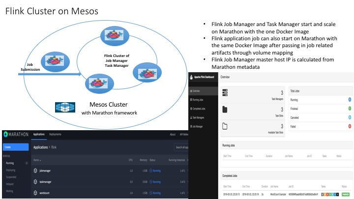

## Flink Cluster on Mesos

[Reference Flink Cluster Setup](https://ci.apache.org/projects/flink/flink-docs-master/setup/cluster_setup.html)

[Reference Flink Docker](https://github.com/apache/flink/tree/master/flink-contrib/docker-flink/flink)

### Build Docker Image

[Dockerfile](Dockerfile)

* Download Flink Spark 0.10.2 with Hadoop 2.7

### Start Flink with Marathon

#### Start Job Manager

[Job Manager job description](./marathon/marathon-job.json) 

	curl -i -H 'Content-Type: application/json' -d@marathon/marathon-job.json $marathonIp:8080/v2/apps

#### Start Task Manager

[Task Manager job description](./marathon/marathon-task.json) 

	curl -i -H 'Content-Type: application/json' -d@marathon/marathon-task.json $marathonIp:8080/v2/apps

### Verify Flink Cluster

#### The console

* Job Manager console start at $JOB_MANAGER_HOST:8080
* Web Submission Client console start at  $JOB_MANAGER_HOST:8081

#### Run Flink WorkCount sample with command line

	./bin/flink run -m $JOB_MANAGER_HOST:6123 ./examples/WordCount.jar  file:///usr/local/flink-0.10.2/conf/flink-conf.yaml file:///usr/local/flink-0.10.2/conf/flink-conf.yaml.out

#### Run Flink WorkCount sample with Marathon

[WorkCount application description](./marathon/marathon-app.json) 

	curl -i -H 'Content-Type: application/json' -d@marathon/marathon-app.json $marathonIp:8080/v2/apps

#### Run Flink Dataflow WorkCount sample with Marathon

[WorkCount application description](./marathon/marathon-dataflow.json) 

	curl -i -H 'Content-Type: application/json' -d@marathon/marathon-dataflow.json $marathonIp:8080/v2/apps

### Known Issue and Improvements