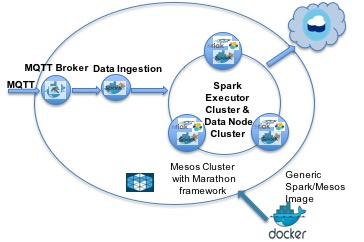

## MQTT on Mesos 

[MQTT](https://github.com/eclipse/mosquitto)

### Build Docker Image 

[The image details](Dockerfile)

### Start on Marathon:
	
	curl -i -H 'Content-Type: application/json' -d@marathon/$marathonFile.json $marathonIp:8080/v2/apps
	
* [revise MQTT broker job](marathon/marathon.json). The MQTT broker at $HOST_IP:1883

#### To verify

	mqtt sub -t 'test' -h '$HOST_IP' -v
	mqtt pub -t 'test' -h '$HOST_IP' -m 'from MQTT.js'

### Run MQTT Data Ingestion

* [revise a sample MQTT data injection to cloudant job](marathon/marathon-mqtt-cloudant.json).

	mqtt pub -t 'mytopic' -h '$HOST_IP' -m '001001,2016/4/1 00:20:04,144,104,24,24,1015,45,5,5'

### Known Issue

