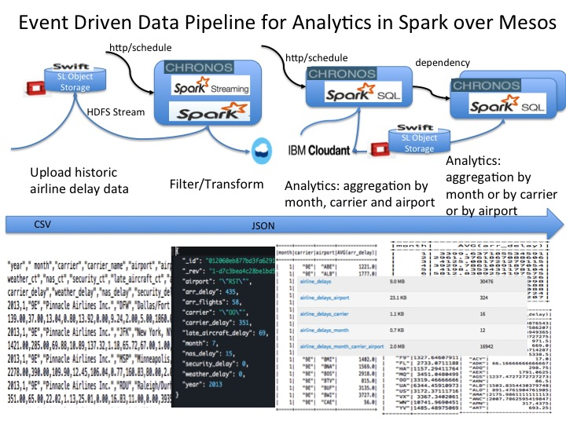
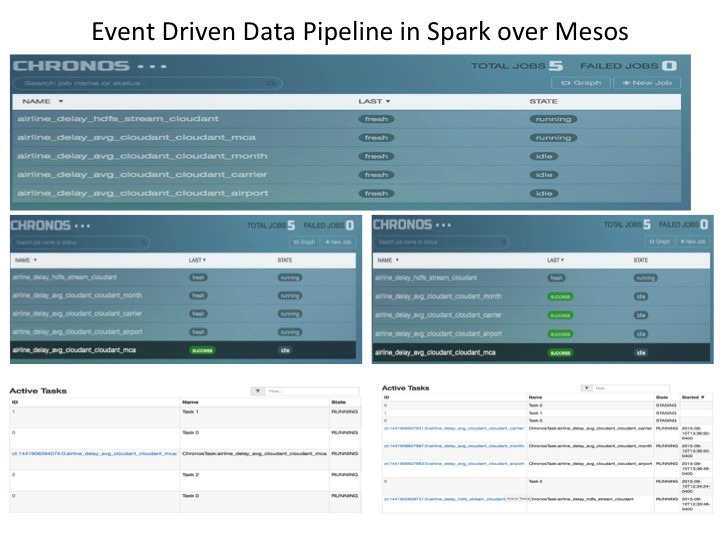

## An Event Driven Data Pipeline Scenario

An Event Driven Data Pipeline Scenario with Spark Stream, Spark SQL, Cloudant, Swift(Softlayer Object Storage)

## Verification on Local

* [Reference Spark setup with Swift and Cloudant enablement](../spark-lambda/README_Spark_Lambda.md)
	
* [Download yearly airport delay data](http://www.transtats.bts.gov/OT_Delay/OT_DelayCause1.asp?pn=1)

### File Stream filter and transform airport delay data into cloudant 

[source at python/HDFS_Stream_Cloudant.py](python/HDFS_Stream_Cloudant.py)

	spark-submit --jars cloudant-spark.jar python/HDFS_Stream_Cloudant.py swift://ylsparkstream.sjc01/airline yanglei.cloudant.com ntledesewstarkalkedirsee b0VbcAS7davOYC0f4umPC2BR airline_delays

* upload airport delay files into container after the application is started

### Aggregate Airport delay data into Cloudant

[source at python/DelayAvg_Cloudant.py](python/DelayAvg_Cloudant.py)

#### by month, carrier, airport from transformed data

	spark-submit --jars lib/cloudant-spark.jar python/DelayAvg_Cloudant.py yanglei.cloudant.com ntledesewstarkalkedirsee b0VbcAS7davOYC0f4umPC2BR airline_delays month,carrier,airport  airline_delays_month_carrier_airport

#### by carrier from by month, carrier, airport 

	spark-submit --jars lib/cloudant-spark.jar python/DelayAvg_Cloudant.py yanglei.cloudant.com ntledesewstarkalkedirsee b0VbcAS7davOYC0f4umPC2BR airline_delays_month_carrier_airport carrier airline_delays_carrier

#### by airport from by month, carrier, airport

	spark-submit --jars lib/cloudant-spark.jar python/DelayAvg_Cloudant.py yanglei.cloudant.com ntledesewstarkalkedirsee b0VbcAS7davOYC0f4umPC2BR airline_delays_month_carrier_airport  airport airline_delays_airport

#### by month from by month, carrier, airport

	spark-submit --jars lib/cloudant-spark.jar python/DelayAvg_Cloudant.py yanglei.cloudant.com ntledesewstarkalkedirsee b0VbcAS7davOYC0f4umPC2BR airline_delays_month_carrier_airport  month airline_delays_month

### Aggregate Airport delay data into HDFS

* [python/DelayAvg_Cloudant_HDFS.py](python/DelayAvg_Cloudant_HDFS.py)
* [python/DelayAvg_HDFS_HDFS.py](python/DelayAvg_HDFS_HDFS.py)

#### by month, carrier, airport from transformed data

	spark-submit --jars lib/cloudant-spark.jar python/DelayAvg_Cloudant_HDFS.py yanglei.cloudant.com ntledesewstarkalkedirsee b0VbcAS7davOYC0f4umPC2BR airline_delays month,carrier,airport  output/airline_delays_month_carrier_airport.json

#### by carrier from by month, carrier, airport 

	spark-submit --jars lib/cloudant-spark.jar python/DelayAvg_HDFS_HDFS.py output/airline_delays_month_carrier_airport.json carrier output/airline_delays_carrier.json

#### by airport from by month, carrier, airport

	spark-submit --jars lib/cloudant-spark.jar python/DelayAvg_HDFS_HDFS.py output/airline_delays_month_carrier_airport.json airport output/airline_delays_airport.json

#### by month from by month, carrier, airport

	spark-submit --jars lib/cloudant-spark.jar python/DelayAvg_HDFS_HDFS.py output/airline_delays_month_carrier_airport.json month output/airline_delays_month.json

## Build Docker Image 

### Build the Docker image

* Make sure to create core-site.xml and put under lib before building Docker Image

[The image details](Dockerfile)

* Download Spark 1.4.1 with Hadoop 2.6 supporting SL Object Storage
* Download Spark SQL Cloudant 1.4.1.2

## Verification on Chronos:

	curl -L -X GET $HOST_IP:8080/scheduler/jobs

### Verification for Cloudant
	
#### Primary job

	curl -L -H 'Content-Type: application/json' -X POST -d@jobs/$jobname.json $HOST_IP:8080/scheduler/iso8601

* [revise job of File Stream filter and transform airport delay data into cloudant](jobs/chronos_hdfs_cloudant.json)

* [revise job of Aggregate Airport delay data by month, carrier, airport ](jobs/chronos_cloudant_cloudant.json)

#### Dependent job

	curl -L -H 'Content-Type: application/json' -X POST -d@jobs/$jobname.json $HOST_IP:8080/scheduler/dependency
	
* [revise job of Aggregate Airport delay data by month](jobs/chronos_cloudant_cloudant_month.json)

* [revise job of Aggregate Airport delay data by carrier](jobs/chronos_cloudant_cloudant_carrier.json)

* [revise job of Aggregate Airport delay data by airport](jobs/chronos_cloudant_cloudant_airport.json)

### Known Issue

* Save to swift hit SocketTimeout
