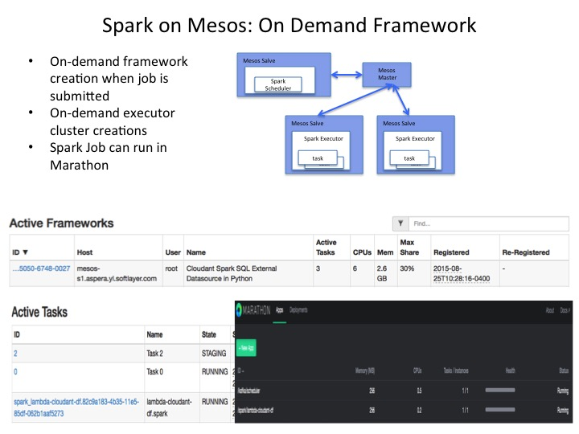
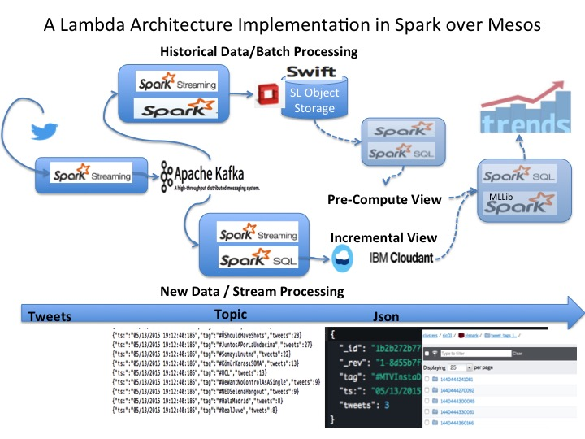
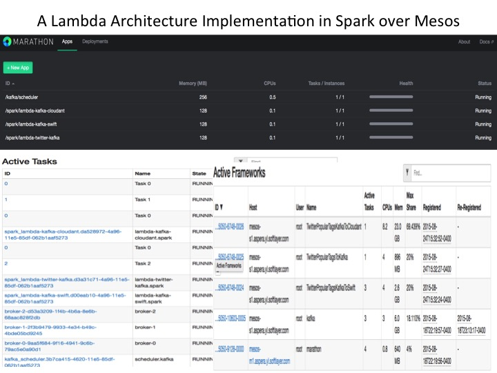

## Mesos Framework - Spark 

[Referece Run Spark on Mesos](http://spark.apache.org/docs/latest/running-on-mesos.html)

## A Lambda Architecture Scenario

A Lambda Architecture Implentation with Spark Stream, Spark SQL, Kafka, Cloudant, Swift(Softlayer Object Storage)

### Pre-req for Swift related jobs

* [Spark distribution with Swift and Softlayer Object Storage support](../spark-standalone/README_spark.md)

* Need to copy the 2 files under lib before building Docker Image

	core-site.xml
	spark-1.4.1-bin-custom-spark-softlayer.tgz

### Build the source 

	cd source
	sbt package
	
### Prep the Verification environment

	cp source/target/scala-2.10/spark_lambda_2.10-0.1-SNAPSHOT.jar ../spark_lambda.jar
	wget https://github.com/cloudant/spark-cloudant/releases/download/v1.4.1.1/cloudant-spark.jar
	
#### Verify TwitterPopularTagsToKafka

[source at src/main/scala/mytest/spark/stream/TwitterPopularTagsToKafka.scala](source/src/main/scala/mytest/spark/stream/TwitterPopularTagsToKafka.scala)

	spark-submit --class mytest.spark.stream.TwitterPopularTagsToKafka --master local[4] --packages org.apache.spark:spark-streaming-twitter_2.10:1.4.1,org.apache.kafka:kafka_2.10:0.8.2.1 spark_lambda.jar <consumerKey> <consumerSecret> <access token> <access token secret> <brokers> <topic> [<filters>]

#### Verify TwitterPopularTagsKafkaToCloudant

[source at src/main/scala/mytest/spark/stream/TwitterPopularTagsToCloudant.scala](source/src/main/scala/mytest/spark/stream/TwitterPopularTagsKafkaToCloudant.scala)

	spark-submit --class mytest.spark.stream.TwitterPopularTagsKafkaToCloudant --master local[4] --packages org.apache.spark:spark-streaming-kafka_2.10:1.4.1 --jars cloudant-spark.jar spark_lambda.jar <kafka zk> mygroup mytopic 1 <cloudantHost> <cloudantUser> <cloudantPassword>

#### Verify TwitterPopularTagsKafkaToSwift

[source at src/main/scala/mytest/spark/stream/TwitterPopularTagsToSwift.scala](source/src/main/scala/mytest/spark/stream/TwitterPopularTagsKafkaToSwift.scala)

	spark-submit --class mytest.spark.stream.TwitterPopularTagsKafkaToSwift --master local[4] --packages org.apache.spark:spark-streaming-kafka_2.10:1.4.1 spark_lambda.jar  <kafka zk> mygroup mytopic 1 <swift://container.PROVIDER/path>

### Build Docker Image 

#### Build the Docker image

[The image details](Dockerfile)

* Spark 1.4.1 with Hadoop 2.6 supporting SL Object Storage
* Download Spark SQL Cloudant 1.4.1.1
* Built spark-stream project

### Verification on Marathon:
	
	curl -i -H 'Content-Type: application/json' -d@marathon/filename.json $marathonIp:8080/v2/apps
	
####  Basic function verification

* [revise spark sql over Cloudant dataframe python job](marathon/marathon-cloudant-df.json)

* [revise spark swift python job](marathon/marathon-swift.json)

### A Lambda Architecture Scenario run on Mesos

* [revise spark stream of twitter popular tag to Kafka Scala job](marathon/marathon-twitter-kafka.json)

* [revise spark stream of Kafka of twitter popular tag to Cloudant Scala job](marathon/marathon-kafka-cloudant.json)

* [revise spark stream of Kafka of twitter popular tag to Swift Scala job](marathon/marathon-kafka-swift.json)

