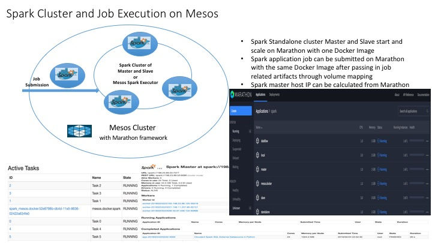

## Spark on Mesos

[Reference Spark running on Mesos](http://spark.apache.org/docs/latest/running-on-mesos.html)
[Reference Spark running as Standalone](http://spark.apache.org/docs/latest/spark-standalone.html)

### Build Docker Image

[Dockerfile](Dockerfile)

* Download Spark 1.6.0 with Hadoop 2.6
* Install Java 8 and Latest Mesos

### Start Spark Standalone Cluster with Marathon

#### Start Master

[Spark Master job description](./marathon/marathon-master.json) 

	curl -i -H 'Content-Type: application/json' -d@marathon/marathon-master.json $marathonIp:8080/v2/apps

#### Start Slave

[Spark Slave job description](./marathon/marathon-slave.json) 

	curl -i -H 'Content-Type: application/json' -d@marathon/marathon-slave.json $marathonIp:8080/v2/apps

#### The console

* Spark Master at : spark://$SPARK_MASTER_HOST:7077
* Spark Master console start at: $SPARK_MASTER_HOST:8080
* Spark Slave console start at: $SPARK_SLAVE_HOST:8081

### Submit Spark Job using Marathon

#### on local Spark Master

[Cloudant Python Sample](./marathon/marathon-local.json) 

	curl -i -H 'Content-Type: application/json' -d@marathon/marathon-local.json $marathonIp:8080/v2/apps

#### on Spark Standalone Cluster

[Cloudant Python Sample](./marathon/marathon-standalone.json) 

	curl -i -H 'Content-Type: application/json' -d@marathon/marathon-standalone.json $marathonIp:8080/v2/apps

#### on Mesos master with docker executor

[Cloudant Python Sample](./marathon/marathon-mesos-docker.json) 

	curl -i -H 'Content-Type: application/json' -d@marathon/marathon-mesos-docker.json $marathonIp:8080/v2/apps

#### Dataflow WordCount on Mesos master with docker executor

[Dataflow WorkCount Java application](./marathon/marathon-dataflow.json) 

	curl -i -H 'Content-Type: application/json' -d@marathon/marathon-dataflow.json $marathonIp:8080/v2/apps

### Known Issue and Improvements