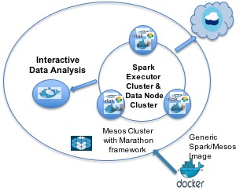

## Zeppelin on Mesos 

[Zeppelin](http://zeppelin.incubator.apache.org/docs/install/install.html)
[Zeppelin Tutorial](http://zeppelin.incubator.apache.org/docs/tutorial/tutorial.html)

### Build Docker Image 

[The image details](Dockerfile)

* Spark 1.6.1 with Hadoop 2.6

### Start on Marathon:
	
	curl -i -H 'Content-Type: application/json' -d@marathon/$marathonFile.json $marathonIp:8080/v2/apps
	
* [revise Zeppelin run local job](marathon/marathon-local.json). The zeppelin console is at http://$HOST_IP:8080

* [revise Zeppelin run on mesos job](marathon/marathon-mesos.json). The zeppelin console is at http://$HOST_IP:8080

### Verification

* [Notebook for Cloudant](notebook/CloudantDFOption.scala)

### Known Issue

