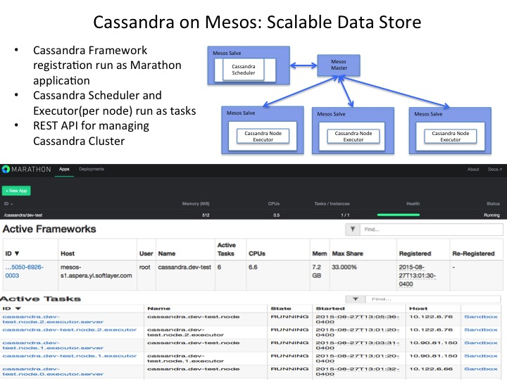

## Cassandra on Mesos 

[Cassandra on Mesos](https://github.com/mesosphere/cassandra-mesos)

### Start on Marathon:
	
	curl -i -H 'Content-Type: application/json' -d@marathon/marathon.json $marathonIp:8080/v2/apps
	
* [revise the downloaded Cassandra on Mesos](marathon/marathon.json).

### Verification

[Cassandra on Mesos REST API](http://mesosphere.github.io/cassandra-mesos/docs/rest-api.html)

	curl -i -H 'Content-Type: application/json' http://$HOST_IP:$CPORT/live-nodes
	
	cqlsh $liveNodeIP 9042

* Note you can get the above host and port from marathon application console

### Known Issue

* Destroy marathon job will not stop the exectors and schedulers. 