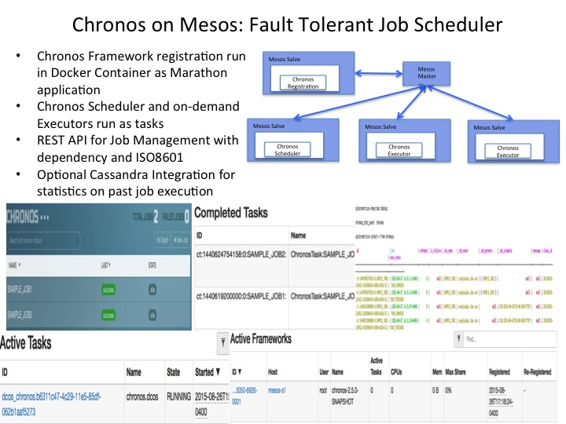

## Chronos on Mesos 

[Chronos](https://mesos.github.io/chronos/docs/getting-started.html)
[Chronos with Cassandra](http://wjb-tech.blogspot.com/2015/06/chronos-with-cassandra.html?m=1)

### Build Docker Image 

[The image details](Dockerfile)

### Start container on Marathon:
	
#### Chronos without Cassandra

	curl -i -H 'Content-Type: application/json' -d@marathon/marathon.json $marathonIp:8080/v2/apps
	
* [revise Chronos on Mesos](marathon/marathon.json). The Chronos console is at http://$HOST_IP:8080

#### Chronos with Cassandra for past job statistics

	curl -i -H 'Content-Type: application/json' -d@marathon/marathon-cassandra.json $marathonIp:8080/v2/apps
	
* create cassandra keyspace	

	CREATE KEYSPACE metrics WITH REPLICATION = { 'class' : 'SimpleStrategy', 'replication_factor' : 1 };
	use metrics
	describe tables;
	select * from chronos;

* [revise Chronos with Cassandra on Mesos](marathon/marathon-cassandra.json). The Chronos console is at http://$HOST_IP:8080

### Verification of Chronos

[Chronos REST API](https://mesos.github.io/chronos/docs/api.html#adding-a-scheduled-job)

	curl -L -H 'Content-Type: application/json' -X POST -d@jobs/sample_job1.json $HOST_IP:8080/scheduler/iso8601
	curl -L -H 'Content-Type: application/json' -X POST -d@jobs/sample_job2.json $HOST_IP:8080/scheduler/dependency
	curl -L -X GET $HOST_IP:8080/scheduler/jobs
	
	
### Known Issue

