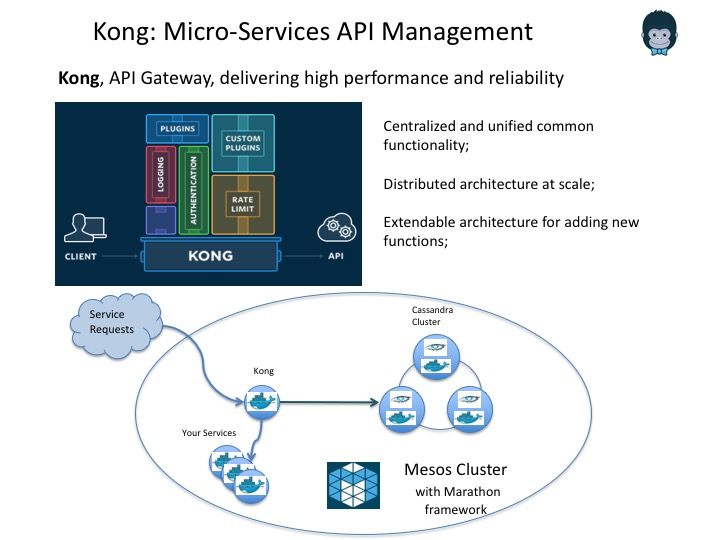

## Kong on Mesos 

* [Kong](https://getkong.org)
* [Kong in Docker](https://github.com/Mashape/docker-kong)

### Start on Marathon:
	
	curl -i -H 'Content-Type: application/json' -d@marathon/marathon.json $marathonIp:8080/v2/apps
	
	
* revise [JSON](marathon/marathon.json). 

* The HTTP endpoint at: $HOST_IP:8001 (admin); $HOST_IP:8000 (proxy)

### Sample usage

[Details on plugins](https://getkong.org/plugins/)

#### Add API and verify

	curl -i -X POST --url http://$HOST_IP:8001/apis/ --data 'name=mymockbin' --data 'upstream_url=http://mockbin.com/' --data 'request_host=mockbin.com'
	
	curl -i -X GET --url http://$HOST_IP:8000/  --header 'Host: mockbin.com'

#### Access Control: Enable key-auth plugin
	
	curl -i -X POST --url http://$HOST_IP:8001/apis/mymockbin/plugins/   --data 'name=key-auth'
	
	curl -i -X GET --url http://$HOST_IP:8000/  --header 'Host: mockbin.com' (get 401)
	
##### Add consumer, key credential and verify

	curl -i -X POST --url http://$HOST_IP:8001/consumers/  --data "username=Yang"
	curl -i -X POST --url http://$HOST_IP:8001/consumers/Yang/key-auth/ --data 'key=mykey'
	curl -i -X GET  --url http://$HOST_IP:8000 --header "Host: mockbin.com"  --header "apikey: mykey"

#### Traffic Control: Enable rate-limiting plugin

	curl -X POST http://$HOST_IP:8001/apis/mymockbin/plugins  --data "name=rate-limiting" --data "config.second=1"  --data "config.hour=10000"
	
	curl -i -X GET  --url http://$HOST_IP:8000 --header "Host: mockbin.com"  --header "apikey: mykey"  (get 503 when over the limit)
	
#### Analytics with Gelileo ( with a trial token)

	curl -X POST http://$HOST_IP:8001/apis/mymockbin/plugins/ --data "name=mashape-analytics" --data "config.service_token=your token" --data "config.environment=default-environment"
    
#### Statistics from NginX

	curl http://$HOST_IP:8001/status/
    
### Custom Plugin

[Reference](https://getkong.org/docs/0.5.x/plugin-development/)

### Known Issue

