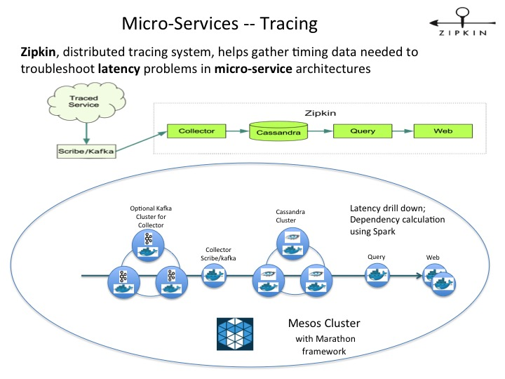

## Zipkin on Mesos 

* [Zipkin](https://github.com/openzipkin/zipkin)
* [Zipkin in Docker](https://github.com/openzipkin/docker-zipkin) and [sample configuration](https://github.com/openzipkin/docker-zipkin/blob/master/docker-compose.yml)

### Start on Marathon:
	
	curl -i -H 'Content-Type: application/json' -d@marathon/$marathonFile.json $marathonIp:8080/v2/apps
	
#### Query

	/api/v1/services
	/api/v1/traces?serviceName=zipkin-query
	
* revise [Query JSON](marathon/marathon-query.json). 

* The HTTP endpoint at: $HOST_IP:9411

#### Web

* [Web](marathon/marathon-web.json). 

* The console is at $HOST_IP:8080

#### Collector

##### with Scribe
	
* [Collector with Scribe](marathon/marathon-collector.json).

##### with Kafka

* [Collector with Kafka](marathon/marathon-collector-kafka.json).

### Sample usage

#### Create sample trace point using Scribe

	git clone https://github.com/openzipkin/zipkin.git
	cd zipkin
	bin/tracegen $COLLECTOR_HOST_IP
	
#### Other Zipkin integrations

[AcmeAir NodeJS](https://github.com/yanglei99/acmeair-nodejs)

	
#### Aggregate dependencies using Spark

	git clone https://github.com/openzipkin/zipkin-dependencies-spark.git
	cd zipkin-dependencies-spark/
	export CASSANDRA_HOST=one of your cassandra host
	./gradlew run
	
### Known Issue

