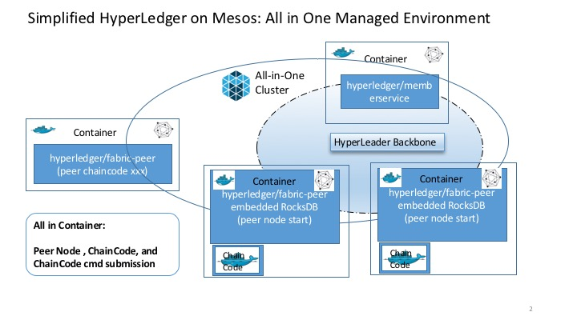

## HyperLedger 

[Reference](https://github.com/hyperledger/hyperledger)
[Fabric](https://github.com/hyperledger/fabric)

### Build the Docker Image

[Reference](https://github.com/hyperledger/fabric/blob/master/docs/dev-setup/install.md)

### Run Peer nodes on Mesosphere DCOS

	curl -i -H 'Content-Type: application/json' -d@marathon/marathon.json $marathonIp:8080/v2/apps
	
#### Run 2 Peer nodes without consensus

* [revise peer node vp0 start](marathon/marathon_vp0.json)
* [revise peer node vp1 start](marathon/marathon_vp1.json)

#### Run 4 Peer nodes with PBFT

* [revise peer node vp0 start](marathon/marathon_pbft_vp0.json)
* [revise peer node vp1 start](marathon/marathon_pbft_vp1.json)
* [revise peer node vp2 start](marathon/marathon_pbft_vp2.json)
* [revise peer node vp3 start](marathon/marathon_pbft_vp3.json)

### Deploy and Run Chain Code

* [revise chain code deploy](marathon/marathon_chaincode_deploy.json)
* [revise chain code invoke with deployed chaincode name](marathon/marathon_chaincode_invoke.json)
* [revise chain code query with deployed chaincode name](marathon/marathon_chaincode_query.json)

### Known issues and Workaround

* On Mesos DCOS, make sure to enable docker remote API on Agent(Slave)

* hyperledger/fabric-peer is not on docker.io. Work around the issue by tagging the built image with my own name and push it to docker hub.

* Chain code deployment depends on hyperledger/fabric-baseimage which is not on docker.io . Work around the issue by downloading the built image to Mesos Agent(Slave)